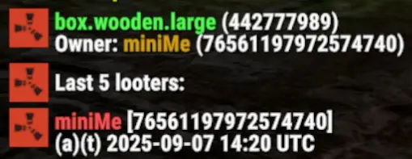

# FAR Box Looters

## Licensing & Credits
This plugin is a derivative work of "Box Looters" by `k1lly0u`. The original license is provided in `ORIGINAL-LICENSE.txt`, and further attribution details can be found in `NOTICE.FARBoxLooters.md`. This derivative work is also licensed under the MIT License.

## Description
The **FAR Box Looters** plugin reimagines how server administrators track container interactions in Rust. Inspired by the foundational work of "Box Looters" by `k1lly0u`, this plugin was developed to overcome critical limitations of its predecessor, particularly regarding excessive memory consumption, maintenance, and the granularity of historical data. By pivoting to an efficient SQLite database for persistent storage, FAR Box Looters dramatically reduces server RAM footprint while offering superior detail, including precise item-level changes (what was added, what was removed) for every loot event. This provides an indispensable tool for server owners to investigate suspicious activity, track item movements, and identify e.g. "inside jobs" with unprecedented clarity.



## The Evolution: Why FAR Box Looters?

The original "Box Looters" plugin, while a valuable concept, presented several challenges:
*   **Memory Intensive:** It stored *all* loot events for *all* containers in server RAM, leading to memory usage often exceeding 100 MiB, even necessitating a 48-hour data retention limit to keep things manageable.
*   **Maintenance & Compatibility:** The original plugin has not been updated in over two years, rendering it uncompilable with current Rust game versions without manual community fixes.
*   **Limited Detail:** It primarily captured that a loot event occurred, lacking the crucial specifics of *which items* were added or removed during the interaction, and the auth / team status of the looter.

**FAR Box Looters** was born from the understanding that disk space is cheap, but server RAM is not. Our solution:
*   **SQLite-First Approach:** Every 60 seconds all loot events are efficiently written and off-loaded to a local SQLite database, freeing up server RAM. This fundamentally shifts the data burden from volatile memory to persistent, affordable disk storage.
*   **Massive Memory Reduction:** Servers running FAR Box Looters have reported memory usage reductions from over 100 MiB to typically ≤ 10 MiB for this functionality.
*   **Infinite Data Retention:** With data safely on disk, there's no need to arbitrarily delete history. All events are logged from wipe to wipe (unless manually cleared), providing a complete audit trail.
*   **Item-Level Granularity:** Beyond just recording a loot event, FAR Box Looters logs the exact items that were added `(++)` or removed `(--)` from a container, offering unparalleled insight into item flow.
*   **Trust & Team Awareness:** Loot events include flags indicating if the player was authorized on the governing Tool Cupboard `(a)` or in a team with the owner `(t)` at the time of the interaction, providing critical context for investigating "inside jobs."

## Changelog

### 1.2.2 - 2025-09-17
*   **Improved Exclusions:** Made sure you can exclude e.g. "BaseVehicle" and ensure attached storage (which is "StorageContainer") really is ignored.

### 1.2.1 - 2025-09-16
*   **Sanitized Configuration:** Reverted `DbFileName` to be non-configurable. Making that configurable was stupid.
*   **Added wipe detection:** Borrowed code from "Box Looters" by `k1lly0u` to detect wipes and remove / recreate the database.
*   **Added wireframe display:** Borrowed code from "Box Looters" by `k1lly0u` to replace bulky chat output with a wireframe debug overlay. It now highlights destroyed and picked-up boxes with extra information.

### 1.2.0 - 2025-09-14
*   **Version Bump:** First public release as FAR Box Looters (1.1.5) bumped to 1.2.0.
*   **Enhanced Configuration:** Introduced new configuration options for `FlushInterval`, `DbFileName`, and detailed `IncludeEntities` and `ExcludeEntities` lists to precisely control what is tracked.
*   **Improved Box Status Distinction:** Fixed an issue where "picked up" boxes were incorrectly classified as "destroyed" in history.
*   **`/box id` Command Enhancement:** The `/box id` command now provides the last known item changes (added/removed) for the specified box's history, mirroring the detail of `/box detail`.
*   **Custom Lootable Entities:** Users can now define additional entity types to track (e.g., `BasePlayer` for sleeper looting) via the `IncludeEntities` configuration.
*   **New Console Command `box track`:** Added a command to display a list of all currently tracked lootable entity types directly in the server console, allowing for easy verification of configuration.
*   **Startup Tracking Output:** The list of tracked entities (from `box track`) is now automatically sent to the server console upon plugin load for immediate reference.

## Commands

All chat commands require players to have **auth level 1 (moderator) or 2 (owner)**. There are no specific permissions to grant.

*   `/box`
    *   **Function:** When looking at a container, this command recalls the most recent 5 loot events for that box.
    *   **Output:** Displays the last 5 players who looted the box, in reverse chronological order (most recent first). Includes `(a)` if the looter was TC authorized and `(t)` if they were in a team with the owner at the time of the event; otherwise, `(-)` is shown.
    *   **Example:** `[1] minime (t) (-) - 1m ago`
*   `/box diag`
    *   **Function:** Checks the health and performance of the SQLite storage system, ensuring loot events are being processed without backlog.
    *   **Use:** Provides peace of mind that the batched SQL writes are keeping up with server activity.
    *   **Health:** The plugin assesses health every time the server saves and outputs pending data count to the server console for easy access.
    *   **Output:** Example: `[FAR Box Looters] diag: queuedSql=0, pendingItems=0, lastLootEntries=0, nameCache=0`
*   `/box clear`
    *   **Function:** Drops the current loot event database and creates a new, empty one.
    *   **Requirement:** Requires **auth level 2**.
    *   **Use:** Essential for cleaning the database after a server wipe.
*   `/box detail [count]`
    *   **Function:** Provides in-depth details for the container the administrator is looking at.
    *   **Argument:** `[count]` limits how many of the most recent loot events are shown (reverse chronological order).
    *   **Output:** Includes standard `/box` details, plus a breakdown of `(++)` items added and `(--)` items removed for each of the `[count]` most recent loot events.
*   `/box help`
    *   **Function:** Displays a summary of all available `/box` commands.
    *   **Also shown:** If an unrecognized `/box` subcommand is entered.
*   `/box id <NetId>`
    *   **Function:** Recalls the loot history for a specific container using its `NetId`.
    *   **Use:** Crucial for investigating boxes that no longer exist (destroyed or picked up).
    *   **Output:** Same format as `/box detail`.
*   `/box near [radius]` *(radius can be 1-100m)*
    *   **Function:** Lists all containers within an optional `radius` (default: 20 meters) around the administrator's current position.
    *   **Output:** Includes each box's `NetId` and its current `status` (active, destroyed, picked-up) for further investigation.
*   `/box player <player_name_or_SteamID> [radius]` *(radius can be 1-100m)*
    *   **Function:** Filters the list of boxes around the administrator (within an optional `radius`, default: 20 meters) to show only those looted by the specified `player`. The player name can be partial or a SteamID.
    *   **Output:** Lists relevant boxes with their `NetId` and `status`.

## Performance & Data Management

*   **RAM Efficiency:** FAR Box Looters has demonstrated a significant reduction in RAM usage, typically operating at ≤ 10 MiB, a dramatic improvement over the original's ≥ 100 MiB.
*   **Disk Space:** The SQLite database file, located in your `oxide/data` (or `carbon/data`) folder, is optimized for size. On a busy server, expect it to reach around ~20 MiB after a week, and likely not much more than 100 MiB over an entire wipe cycle. Access to this data remains lightning-fast, ensuring no noticeable in-game delays when querying history.
*   **Important Wipe Note:** The plugin retains all historical data in the SQLite database indefinitely. To prevent the database file from growing excessively over multiple wipes, **it is crucial to either manually delete the `FARBoxLooters.sqlite` file from `oxide/data` (or `carbon/data`) or run the `/box clear` command after each server wipe.**

## RCON Commands

For automated administration and server health monitoring, the following commands can be executed via RCON:
*   `box clear` (clears database without warning - if you don't wait for wipe)
*   `box diag`  (prints queued items waiting to go to SQLite)
*   `box track` (prints list of tracked entity types to console)

## Current Development & Unique Strengths

While FAR Box Looters should now be en par feature-wise with the original "Box Looters" plugin, it offers unique advantages:
*   **Unparalleled Item Detail:** The ability to see exactly *what* items were moved in and out of a box is a game-changer for investigations.
*   **Contextual Insight:** The `(a)` and `(t)` flags provide crucial information regarding player trust and team dynamics, aiding in the detection of e.g. "inside jobs".
*   **Permanent Record:** All data is retained until explicitly cleared or a server wipe occurred, providing a complete and accessible history for any past event.

## Configuration
The plugin provides several configuration options to tailor its behavior to your server's needs. The configuration file `FARBoxLooters.json` can be found in your `oxide/config` (or `carbon/config`) folder after the first load.

```json
{
  "ChatLineLimit": 15,      // maximum number of lines for the chat
  "ExcludeEntities": [      // list of entity types or subtypes to exclude
    "BaseVehicle",          // you likely don't want to track vehicle mounted storage
    "LootContainer"         // always (!) EXCLUDE roadside loot, barrels, crates, etc.
  ],
  "FlushInterval": 60.0,    // interval in seconds for saving to SQLite database
  "IncludeEntities": [      // list of entity types or subtypes to include
    "BasePlayer",           // you can add BasePlayer to register looted sleepers
    "BuildingPrivilegeRetro", // you should include this TC (the other 2 are already)
    "ContainerIOEntity",    // or ContainerIOEntity for some new shelves in the game
    "CookingWorkbench",     // you may want to include this new workbench
    "DropBox",              // or this
    "ElectricOven",         // and this
    "MiningQuarry",         // default value from orginal "Box Looters"
    "ResourceExtractorFuelStorage", // default value - e.g. Giant Excavator fuel tank
    "StorageContainer"      // default value, always INCLUDE this - storage boxes, etc.
  ]
}
```

## Installation
1.  Download the `FARBoxLooters.cs` file.
2.  Place the file into your server's `oxide/plugins` (or `carbon/plugins`) folder.
3.  The plugin will automatically load upon server restart or when manually reloaded. The SQLite database file `FARBoxLooters.sqlite` will be created automatically in your `oxide/data` (or `carbon/data`) folder when the plugin first loads.

## Localization
Since this plugin is admin-only all output is English - there are no language files.
