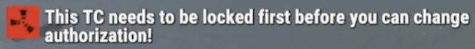

# FAR TC Lock Auth Guard

## Description
The **FAR TC Lock Auth Guard** plugin is designed to enhance the security and management of Tool Cupboard (TC) authorization on your Rust server. It provides server owners with robust controls over who can gain building privileges and interact with TCs, aiming to prevent unauthorized players from easily taking over or griefing bases. This plugin seeks to establish a more controlled and secure TC authorization system, aligning TC behavior with what many server owners desire for enhanced base protection and fair gameplay.

**Are you a user of our FAR Damage Reflection plugin?**  
You don't need `FAR: TC Lock Auth Guard`!  
The TC Lock Auth Guard is already integrated into our Damage Reflection plugin.

## Features
*   **Security by Default:** Adding this plugin will change TC behavior server-wide - TCs will behave as if they were locked even without a lock!
*   **Enhanced Authorization Control:** Enforce base security on players' tool cupboards (TC) - TCs are now equally safe with or without a lock.
*   **Griefing Prevention:** Implement measures to prevent griefers from just walking up, authing and locking out base owners.
*   **Flexible Integration:** Designed to work seamlessly with existing Rust server setups by adding a layer of security.

## Why use FAR TC Lock Auth Guard?
If you ever had players being griefed after they joined your server and turned away disappointed, you know you need this plugin. No strings attached. Some players just forget to lock their TCs, others even leave their base unlocked. If an attacker managed to walk up to their victim's TC and auth on it, also any loot protection you may have will fail. The attacker does not even need to break anything, and affected players won't understand what happened and where their loot went. Stop this by treating any TC as if it were locked until it is actually locked. Once locked, the TC will have vanilla behavior.

## Installation
1.  Download the `FARTCLockAuthGuard.cs` file.
2.  Place the file into your server's `oxide/plugins` (or `carbon/plugins`) folder.
3.  The plugin will automatically load upon server restart or when manually reloaded.

## Configuration
No configuration required

## Commands
No commands implemented

## Permissions
*   `tcauthguard.bypass` - allows players with permission to bypass restrictions.
